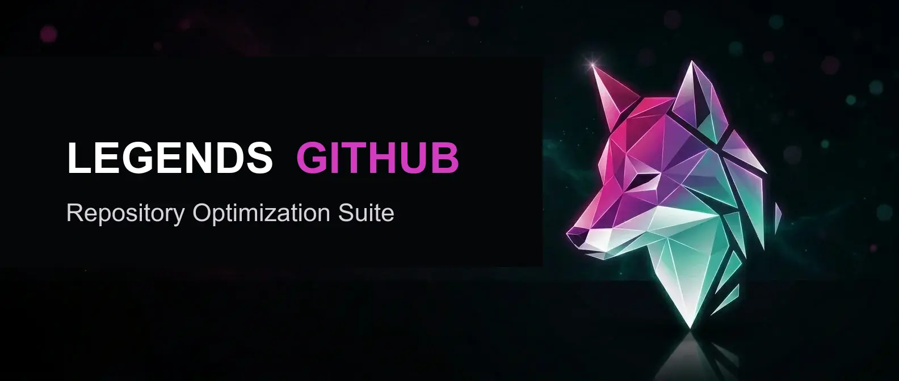

<p align="center">
  
</p>

# Claude GitHub - GitHub Skills for Claude Code and Codex

[](https://github.com/avalonreset/claude-github/releases)
[](https://github.com/avalonreset/claude-github/actions)
[](LICENSE)
[](#how-to-add-skills)
[](https://claude.com/claude-code)
[](https://openai.com/codex)

Claude GitHub is a GitHub repository optimization suite for Claude Code and Codex. One command gives you a 0-100 health score with prioritized fixes. Follow-up commands generate the files, rewrite the README, select the right license, and configure your metadata, all using live keyword data from DataForSEO so every recommendation is specific and measurable.

The same skill suite now installs into either runtime:

- **Claude Code:** slash-command workflow such as `/github audit`, installed under `~/.claude/skills/`
- **Codex:** native skill workflow such as `github-audit`, installed under `~/.codex/skills/`
- **Headless/API:** deterministic runner at `github/scripts/run_headless.py` for audits, metadata plans, legal files, community files, README previews, releases, and portfolio reports

Most GitHub repos are invisible - no keywords in the description, no structured README, missing license files, zero community health signals. Search engines skip them. Developers scroll past them.

> Built with portable `SKILL.md` instructions for Claude Code and Codex.
> Scaffolded with [AgriciDaniel/skill-forge](https://github.com/AgriciDaniel/skill-forge).
> SEO methodology adapted from [AgriciDaniel/claude-seo](https://github.com/AgriciDaniel/claude-seo).


## Table of Contents

- [What You Get](#what-you-get)
- [Skill Examples](#skill-examples)
- [How the Audit Works](#how-the-audit-works)
- [How to Add Skills](#how-to-add-skills)
- [Getting Started](#getting-started)
- [Standard Operating Procedure](#standard-operating-procedure)
- [How Skills Communicate](#how-skills-communicate)
- [Headless Runtime](#headless-runtime)
- [Architecture](#architecture)
- [Best Practices](#best-practices)
- [Frequently Asked Questions](#frequently-asked-questions)
- [Contributing and Security](#contributing-and-security)
- [Community](#community)
- [Other Projects](#other-projects)
- [Disclaimer](#disclaimer)
- [License](#license)

## What You Get

| Command | What It Does |
|---------|-------------|
| `/github audit` | Score any repo 0-100 across 6 categories with prioritized fixes |
| `/github legal` | Select a license, generate SECURITY.md, CITATION.cff by default, handle fork compliance |
| `/github community` | Generate issue templates, CONTRIBUTING.md, CODE_OF_CONDUCT.md, .gitattributes, CI workflow, devcontainer |
| `/github release` | Plan release strategy, CHANGELOG, badges, versioning, and package distribution |
| `/github seo` | Run keyword research with real search volume and difficulty data |
| `/github meta` | Optimize description, topics, homepage URL, feature toggles, and social preview |
| `/github readme` | Generate or rewrite your README with SEO-optimized headings and banner images |
| `/github empire` | Portfolio strategy, profile README, AI avatar generation, profile completeness, cross-linking |

Every recommendation cites its source: DataForSEO keyword volume, GitHub API metadata, codebase analysis, or reference guides. Nothing is guesswork.

## Skill Examples

### Audit Output

```
Overall Score: 60/100

| Category               | Score | Weight | Weighted |
|------------------------|-------|--------|----------|
| README Quality         | 63    | 25%    | 15.8     |
| Metadata & Discovery   | 70    | 20%    | 14.0     |
| Legal Compliance       | 60    | 15%    | 9.0      |
| Community Health       | 52    | 15%    | 7.8      |
| Release & Maintenance  | 48    | 15%    | 7.2      |
| SEO & Discoverability  | 64    | 10%    | 6.4      |

Top 3 Actions (by impact):
1. [Critical] Add badges to README (version, license, CI status)
2. [High] Create CONTRIBUTING.md with contribution guidelines
3. [High] Set up GitHub Releases with semantic versioning
```

### SEO Keyword Discovery

```
Primary Keyword: "claude code skills" (5,400/mo, difficulty 34, Sweet Spot)
GitHub ranks #2 for this query. Recommended for H1, description, first paragraph.

Secondary Keywords:
- "claude code skills marketplace" (320/mo, difficulty 17, +171% quarterly)
- "best claude code skills" (110/mo, difficulty 1, +321% quarterly)
- "how to add skills to claude code" (70/mo, difficulty 32, +586% quarterly)

Topics recommended: claude-code, claude-code-skills, github-optimization...
```

### Workflow

Run `/github audit` and it generates a numbered Standard Operating Procedure with your scores. Run each skill in order: legal, community, release, seo, meta, readme. Each skill hands off to the next. Re-audit at the end to measure your improvement.

## How the Audit Works

Run `/github audit` in Claude Code or `github-audit` in Codex and 6 specialized reviewers score your repo in parallel:

| Category | Weight | What It Checks |
|----------|--------|----------------|
| README Quality | 25% | Structure, headings, badges, table of contents, code examples |
| Metadata and Discovery | 20% | Description keywords, topics, homepage URL, feature toggles |
| Legal Compliance | 15% | License file, SECURITY.md, CITATION.cff, fork obligations |
| Community Health | 15% | Issue templates, CONTRIBUTING, CODE_OF_CONDUCT, devcontainer |
| Release and Maintenance | 15% | Releases, CHANGELOG, CI badges, dependabot, recency |
| SEO and Discoverability | 10% | Keyword placement, GitHub Explore signals, AI citability |

Each reviewer uses a detailed rubric with specific point values per checkpoint, not subjective impressions. The final score is a weighted sum. Claude Code uses subagents; Codex uses multi-agent delegation. All six reviewers launch before aggregation, so a full audit completes quickly instead of walking categories one by one.

### Portfolio Mode

Audit an entire GitHub profile at once:

```
/github audit avalonreset
```

This quick-scans all public repos, selects the top candidates for deep analysis, spawns up to 6 agents per repo, and produces a cross-portfolio report with shared patterns and priorities.

## How to Add Skills

**Prerequisites:** [GitHub CLI](https://cli.github.com/) (`gh`) installed and authenticated. Install either [Claude Code](https://claude.com/claude-code), Codex, or both depending on where you want to run the skills.

### Claude Code Install

**macOS / Linux:**

```bash
git clone https://github.com/avalonreset/claude-github.git
cd claude-github
bash install.sh
```

**Windows (PowerShell):**

```powershell
git clone https://github.com/avalonreset/claude-github.git
cd claude-github
.\install.ps1
```

The Claude installer copies all skills, agents, and reference files to `~/.claude/skills/github/`, then walks you through setting up two services:

### Codex Install

**macOS / Linux:**

```bash
git clone https://github.com/avalonreset/claude-github.git
cd claude-github
bash install-codex.sh
```

**Windows (PowerShell):**

```powershell
git clone https://github.com/avalonreset/claude-github.git
cd claude-github
.\install-codex.ps1
```

The Codex installer copies the orchestrator to `~/.codex/skills/github/`, the specialized skills to `~/.codex/skills/github-*`, the scoring-agent references to `~/.codex/agents/`, and the deterministic runtime to `~/.codex/skills/github/scripts/`.

Both installers can help set up:

- **[DataForSEO](https://dataforseo.com)** (strongly recommended) - powers live keyword research, SERP rankings, and AI visibility tracking. The installer configures the MCP server with your credentials automatically. Without it, SEO-dependent skills fall back to codebase-only analysis and all keyword recommendations are marked "unverified." A free account includes enough credits for hundreds of analyses. A single repo analysis costs about 15-30 cents.
- **[KIE.ai](https://kie.ai/api-key)** (strongly recommended) - generates AI banner images for READMEs and AI profile avatars for your GitHub profile. The installer saves your API key to `.env`. Without it, image generation is skipped entirely. Each image costs about 4 cents.

Both services are technically optional, but without them you lose the two most differentiated features of the suite: data-backed keyword optimization and professional AI-generated visuals. **Set them up during installation.** It takes 5 minutes and makes every other skill dramatically more useful.


Restart Claude Code or Codex after installing. Skills register on startup.

## Getting Started

**Run these skills from inside the project you want to optimize.** This is the single most important thing to get right.

The skills read your actual source code, configuration files, git history, and GitHub remote to understand what your project is and how to improve it. If you run them from an empty folder or from the wrong directory, Claude has no real data to work with and recommendations will be generic at best.

```bash
# Right - run from inside your project
cd ~/projects/my-awesome-tool
claude
> /github audit

# Codex
cd ~/projects/my-awesome-tool
codex
> github-audit

# Wrong - running from a random directory
cd ~/Desktop
claude
> /github audit   # Claude can't see your code, configs, or git remote
```

### Standard Operating Procedure

The audit generates a numbered remediation plan tailored to your repo's scores. Run each skill in order. Each one hands off to the next when it's done.

**Phase 1: Per-Repo Optimization** (repeat for each repo)

| Step | Command | What It Does |
|------|---------|-------------|
| 0 | `/github audit` | Diagnose: scores 6 categories, generates your SOP |
| 1 | `/github legal` | Foundation: license, compliance, fork obligations |
| 2 | `/github community` | Infrastructure: templates, CoC, devcontainer |
| 3 | `/github release` | Versioning: CHANGELOG, badges, catch-up releases |
| 4 | `/github seo` | Research: keyword data for description and README |
| 5 | `/github meta` | Settings: description, topics, features (uses SEO data) |
| 6 | `/github readme` | Capstone: README optimization (uses everything above) |
| 7 | `/github audit` | Measure: re-audit to verify improvement |

Skills scoring 90+ are skipped automatically. Each skill ends with a handoff telling you exactly what to run next. Each skill caches its findings in a `.github-audit/` directory so downstream skills build on previous results instead of starting from scratch.

**Phase 2: Portfolio Optimization** (run once, after all repos are done)

| Command | What It Does |
|---------|-------------|
| `/github empire` | Profile README, cross-linking, topic sync, branding, avatar |

Empire assumes each repo is already in good shape. Always finish Phase 1 on all your repos first.

### What the Skills Read From Your Project

| Source | Skills That Use It | Why |
|--------|-------------------|-----|
| Source code and file structure | README, Community, Release | Detects language, frameworks, project type |
| `package.json`, `Cargo.toml`, etc. | Legal, Community, Release | Identifies dependencies, license conflicts, build tools |
| Git history and remotes | All skills | Determines repo owner, branch strategy, release cadence |
| GitHub API (`gh repo view`) | All skills | Reads description, topics, settings, stars, forks |
| Existing community files | Legal, Community | Checks what already exists before generating |
| DataForSEO (if configured) | SEO, README, Meta | Live keyword volume, difficulty, SERP rankings |

## How Skills Communicate

Every skill follows the **GARE pattern**: Gather, Analyze, Recommend, Execute.

1. **Gather** data from the GitHub API, codebase scan, and DataForSEO
2. **Analyze** the current state against the ideal for your repo type and intent
3. **Recommend** specific changes with data sources cited
4. **Execute** only after you approve, with a confirmation gate before any live changes

Skills share data through a `.github-audit/` cache directory. When you run `/github audit` first, it writes `audit-data.json` and `seo-data.json` that downstream skills consume automatically. This means `/github readme` knows your keyword targets, `/github meta` knows your gaps, and `/github legal` knows your fork status without re-gathering anything.

| Cache File | Written By | Consumed By |
|------------|-----------|-------------|
| `repo-context.json` | Orchestrator | All skills |
| `seo-data.json` | Orchestrator or `/github seo` | `/github readme`, `/github meta` |
| `audit-data.json` | `/github audit` | All downstream skills |
| `legal-data.json` | `/github legal` | `/github readme` (badge selection) |

## Headless Runtime

Codex GitHub includes a deterministic runner for non-interactive audits and automation:

```bash
python3 github/scripts/run_headless.py verify --mode both --path /path/to/repo
python3 github/scripts/run_headless.py audit --path /path/to/repo
python3 github/scripts/run_headless.py seo --path /path/to/repo
python3 github/scripts/run_headless.py legal --path /path/to/repo --write-files
python3 github/scripts/run_headless.py community --path /path/to/repo --write-files
python3 github/scripts/run_headless.py meta --path /path/to/repo
python3 github/scripts/run_headless.py readme --path /path/to/repo --generate-assets
python3 github/scripts/run_headless.py release --path /path/to/repo
python3 github/scripts/run_headless.py empire --path /path/to/repo
```

The runner writes machine-readable cache files under `.github-audit/` plus reports under `.github-audit/output/`. Conversational skills still provide the richer subagent or multi-agent flow; headless mode is for repeatable local checks, API jobs, and automation.

## Architecture

```
claude-github/
├── github/                    # Orchestrator skill
│   ├── SKILL.md               # Routing, intent capture, SEO data pass
│   └── references/            # 9 reference guides (loaded on-demand)
│   ├── scripts/               # Deterministic Codex/headless runtime
│   └── requirements.txt       # Python deps for headless image/TOML support
├── skills/                    # 8 sub-skills
│   ├── github-audit/          # 0-100 health scoring with 6 parallel agents
│   ├── github-legal/          # License selection, SECURITY.md, fork compliance
│   ├── github-community/      # Community health files and templates
│   ├── github-release/        # Release strategy, CHANGELOG, versioning
│   ├── github-seo/            # Keyword research and content strategy
│   ├── github-meta/           # Description, topics, settings, social preview
│   ├── github-readme/         # README generation, SEO optimization, banner images
│   └── github-empire/         # Portfolio strategy, profile README, cross-linking
├── agents/                    # 6 scoring agents (parallel audit)
├── extensions/
│   └── dataforseo/            # DataForSEO MCP server setup
├── install.sh                 # Claude Code macOS/Linux installer
├── install.ps1                # Claude Code Windows installer
├── install-codex.sh           # Codex macOS/Linux installer
└── install-codex.ps1          # Codex Windows installer
```

1 orchestrator, 8 sub-skills, 6 scoring reviewers, 9 reference files, and 1 deterministic runtime. The orchestrator detects your repo type (library, CLI tool, API, application, framework, documentation, or skill/plugin) and adjusts recommendations for each.

## Best Practices

Getting the most out of the skill suite comes down to running from the right place, in the right order, with the right services configured.

**Always run from your project folder.** The skills analyze your actual codebase, git history, and GitHub remote. Running from an empty or unrelated directory gives the agent nothing real to work with. Open Claude Code or Codex in the root of the repo you want to optimize.

**Set up DataForSEO and KIE.ai during installation.** Both are technically optional, but without DataForSEO every keyword recommendation is guesswork, and without KIE.ai you skip banner and avatar generation entirely. Five minutes of setup unlocks the most powerful features in the suite.

**Run audit first.** Always start with `/github audit`. It produces the baseline score and caches findings that every other skill reads. Without it, downstream skills gather data from scratch, which works but takes longer and misses cross-category insights.

**Follow the SOP.** After the audit, run skills in the order shown in the [Standard Operating Procedure](#standard-operating-procedure): legal, community, release, seo, meta, readme. Each skill hands off to the next and builds on the cache from previous steps.

**Review before executing.** Every skill pauses at a confirmation gate before making live changes (pushing releases, editing repo settings, creating files). Read the proposal, adjust if needed, then approve.

**Re-audit after changes.** Run `/github audit` again when you finish. The score delta shows exactly what improved and what still needs attention.

## Frequently Asked Questions

### What are Claude Code skills?

Claude Code skills are markdown instruction files that extend Claude Code with specialized capabilities. They follow the [Agent Skills](https://github.com/anthropics/claude-code) open standard, which means any SKILL.md file placed in `~/.claude/skills/` is automatically loaded when Claude Code starts. Skills can define triggers, reference files, and sub-agents.

### How do I add skills to Claude Code?

Run the installer (`bash install.sh` or `.\install.ps1`). It copies all skill files to `~/.claude/skills/github/` and configures the DataForSEO MCP server. After installation, restart Claude Code and the skills are available immediately. Type `/github` to see available commands.

### How do I add skills to Codex?

Run the Codex installer (`bash install-codex.sh` or `.\install-codex.ps1`). It copies the orchestrator to `~/.codex/skills/github/`, specialized skills to `~/.codex/skills/github-*`, and the headless runtime to `~/.codex/skills/github/scripts/`. Restart Codex, then use commands like `github-audit`, `github-readme`, and `github-meta`.

### How does the parallel audit work in Claude Code and Codex?

Skills are instruction files (SKILL.md) that the host loads based on triggers in your message. Claude Code uses subagents. Codex uses multi-agent delegation. In this suite, the audit flow launches 6 category reviewers at once, one per scoring category, then aggregates only after all six results return.

### Do I need DataForSEO to use this?

No. Every skill works without DataForSEO by falling back to codebase analysis, GitHub API data, and built-in reference guides. However, keyword recommendations will be marked "unverified" without live search data. DataForSEO adds real volume numbers, difficulty scores, and SERP verification for about 15-30 cents per repo analysis.

### What makes Claude GitHub one of the best Claude Code skills for GitHub?

It is the only skill suite that combines live keyword research (via DataForSEO), AI image generation (via KIE.ai), and a structured audit across 6 categories into a single workflow. Most Claude Code skills handle one task. Claude GitHub handles eight, and they share data through a cache so each step builds on the last. The audit-to-readme pipeline takes a repo from zero community health signals to a fully optimized public project in under an hour.

## Contributing and Security

Contributions are welcome. If you find a bug or have a feature request, open an issue. Pull requests are encouraged - see [CONTRIBUTING.md](CONTRIBUTING.md) for guidelines.

For security vulnerabilities, **do not open a public issue.** Email benjamin@rankenstein.pro directly. See [SECURITY.md](SECURITY.md) for the full disclosure policy and response timelines.

## Community

Join [AI Marketing Hub Pro](https://www.skool.com/ai-marketing-hub-pro/about?ref=59f96e9d9f2b4047b53627692d8c8f0c) for access to exclusive projects (referral link).

## Other Projects

**[gemini-seo](https://github.com/avalonreset/gemini-seo)** - 14 professional SEO workflows for Gemini CLI. Technical audits, schema markup, Core Web Vitals, E-E-A-T, and AI search readiness.

**[BenjaminTerm](https://github.com/avalonreset/BenjaminTerm)** - Hacker-styled WezTerm distribution for Windows. Smart clipboard, paste undo, 86 curated dark themes, borderless glass mode.

**[wan2gp-operator](https://github.com/avalonreset/wan2gp-operator)** - CLI operator for Wan2GP text-to-video. VRAM-aware compose, headless batch runs, and a music video pipeline.

## Disclaimer

This tool provides automated recommendations for GitHub repository optimization, including license selection and compliance guidance. **It is not legal, financial, or professional advice.** All recommendations are generated by AI-driven analysis and should be reviewed with your own due diligence before applying. For complex licensing or compliance situations, consult a qualified attorney. The authors assume no liability for decisions made based on this tool's output. See [LICENSE](LICENSE) for full terms.


## License

[MIT](LICENSE). Free and open source. See LICENSE for full terms.
