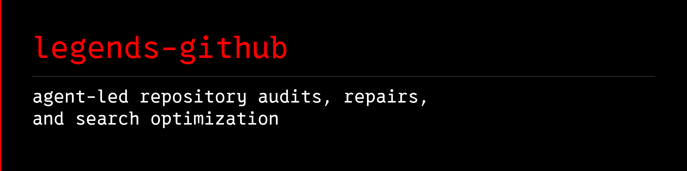

<a name="banner"></a>
<a name="legends-github"></a>

# 

[](https://github.com/avalonreset/legends-github/releases/latest)
[](https://github.com/avalonreset/legends-github/actions/workflows/ci.yml)
[](LICENSE)

A GitHub companion for improving repositories: understand what exists, identify the changes that matter, and turn them into reviewable work.

Use it through your agent or run its Python commands directly. The `cto-legends` router is the only skill; the underlying workflows do not require a particular model vendor.

[Releases](https://github.com/avalonreset/legends-github/releases) · [Modernization plan](docs/MODERNIZATION.md) · [Agent entry point](AGENTS.md) · [MIT license](LICENSE)

## Agent setup (via `cto-legends`)

Part of the [CTO Legends](https://github.com/avalonreset/cto-legends) ecosystem. `cto-legends` is the only registered skill; this repo vendors a pinned copy at `skills/cto-legends/SKILL.md`.

Install with `cto-legends install legends-github`, then follow the module recipe the router loads. Do not register this module as its own skill.

## Start with your repository

Download and extract the [v0.1.0 installable ZIP](https://github.com/avalonreset/legends-github/releases/tag/v0.1.0), or clone this toolkit beside the repository you want to improve. Python 3.10+ and Git are required; authenticated [GitHub CLI](https://cli.github.com/) enables live GitHub metadata and changes.

```sh
git clone --branch v0.1.0 https://github.com/avalonreset/legends-github.git
cd legends-github
python -m pip install -r github/requirements.txt
python legends_github.py capabilities
python legends_github.py --offline --artifacts-dir ./review-output verify --path /path/to/your/repo
python legends_github.py --offline --artifacts-dir ./review-output audit --path /path/to/your/repo
```

On systems where Python is named `python3`, use that instead. Audit commands write local reports and cache files. With `--artifacts-dir`, these are isolated by target repository outside the target itself. They do not apply repository fixes or edit its `.gitignore`. Omit `--offline` when you want live GitHub evidence. Missing GitHub access limits live evidence; it must not be interpreted as proof that a feature is absent.

For agent-driven work, ask your agent to read this toolkit's `AGENTS.md`, then give it the target repository and your objective. The agent needs file access and a command runner. A chat-only service needs a tool bridge or an operator to execute commands.

## What you can do

| Workflow | Useful outcome |
| --- | --- |
| `audit` | Collect versioned findings, distinguish missing from unavailable evidence, and prioritize applicable fixes. |
| `discover` | Build an organic discovery plan: audience, comparison briefs, proof, distribution, and measurement. |
| `readme` | Preserve an existing README for targeted review, or scaffold a missing README with explicit draft requirements. |
| `meta` | Propose descriptions, topics, and repository settings. |
| `community` | Plan contributor documentation and issue workflows. |
| `release` | Plan changelog, versioning, and release preparation. |
| `legal` | Inventory licensing and attribution material for review. |
| `seo` | Produce repository-derived keyword hypotheses; enrich them with research when available. |
| `empire` | Review a portfolio and prepare a consistent presentation. |
| `cache-status` | Inspect evidence saved by earlier workflows. |

Run `python legends_github.py <workflow> --help` for its exact options. Default planning commands still write local artifacts. Flags such as `--write`, `--write-files`, `--apply`, `--generate-assets`, and `--publish` have additional effects; select them deliberately for the user's task.

## Use your agent

The portable interface is files plus commands and JSON output. That is the intended integration boundary for Grok, Codex, Claude, Gemini, Cursor, Meta Muse, and other agent environments. Naming a host here is not a claim that its native integration has been tested.

| Integration | Current state |
| --- | --- |
| Python command interface | Included; independent of agent-specific installation paths. |
| File-based instructions | Read `AGENTS.md` explicitly when the host does not discover it automatically. |
| Skills | `cto-legends` is the only registered skill; the module recipe lives in this README plus `docs/GITHUB-RECIPE.md`. No per-module skill installation exists. |
| Other hosts | Use the command interface where file and shell tools exist. |

No new provider API key is needed for the local audit. Keyword research and image generation are optional capabilities, not prerequisites for basic repository improvement. An existing agent subscription can provide the reasoning; the toolkit does not require its own LLM account.

## How to use the findings

Audits now lead with evidence-backed findings, repository profiles, coverage, and practical next actions. Each finding carries a source, confidence, applicability, and verification. Offline or failed collection is labeled unavailable rather than a missing repository feature.

The retained legacy audit score is a weighted checklist across six categories. It is useful for finding missing signals, but it is **not a validated measure of software quality, security, search ranking, or business value**.

Start with the repository's purpose and audience. Check whether users can install it, understand it, trust its claims, and complete the main workflow. Prioritize broken instructions and missing evidence ahead of decorative badges. Do not add a citation file, community policy, generated artwork, or a release ceremony merely to increase a score.

For each proposed change, record the evidence, expected benefit, effort, and how to verify it. Keep observed facts separate from hypotheses. Parallel reviewers are optional; a single agent can perform the same work sequentially.

## Organic discovery without guesswork

```sh
python legends_github.py --offline --artifacts-dir ./review-output discover --path /path/to/your/repo --audience "intended users" --category "problem this solves" --competitor "a relevant alternative"
```

The plan turns repository evidence into candidate comparison pages, useful examples, metadata, and distribution experiments. Competitor claims, demand, and prices remain unverified until researched. It does not invent keyword volume or publish messages. The same workflow applies to a package, CLI, service, skill, or documentation project. [Discovery guide](docs/DISCOVERY.md) · [GeoGrid validation](docs/GEOGRID-VALIDATION.md).

## Optional artwork

A strong repository does not require a mascot or banner. Keep an existing image if it helps, supply your own local asset, or use the image tool already available in your agent. The toolkit has no paid image-generation integration and asks for no image-provider key. Legacy image flags now reuse or convert local assets only. For a typography-first banner, use the [optional Legends recipe](github/references/legends-banner-style.md) with a supplied font. [Artwork guide](github/references/banner-generation.md).

The [social preview protocol](github/references/social-preview-sop.md) and [README/badge formula](github/references/legends-readme-style.md) ship in this checkout. The fixed-size renderer at `github/scripts/render_social_preview.py` recomposes approved copy at 1280 × 640, measures wrapping, and rejects clipping without shrinking type. Supply your licensed Legends font; it is not bundled. Agents visually inspect outputs and attempt upload with available tools, reporting the exact blocker if manual upload is needed.

## Install route

There are no per-host installers. The router installs this module with `cto-legends install legends-github` after an explicit preview; nothing is written until authorized. For other hosts, start with the explicit `AGENTS.md` workflow instead of guessing an installation directory.

## Project layout

- `legends_github.py`: portable command entry point.
- `github/scripts/`: existing deterministic workflows and shared runtime.
- `github/references/`: rubrics, evidence guidance, and workflow references.
- `skills/cto-legends/SKILL.md`: pinned copy of the router skill (the only skill).
- `docs/GITHUB-RECIPE.md`: router-loaded module recipe.
- `extensions/`: optional service integrations.
- `docs/MODERNIZATION.md`: reconciliation findings, milestones, and acceptance criteria.

## Provenance

Scaffolded with [skill-forge](https://github.com/AgriciDaniel/skill-forge), with SEO methodology adapted from [claude-seo](https://github.com/AgriciDaniel/claude-seo). See the repository's license and attribution files. The house `legends-github-kit` is a separate wrapper around GitHub CLI, not this repository-improvement suite.

## Disclaimer

This tool provides automated recommendations for GitHub repository optimization, including license selection and compliance guidance. **It is not legal, financial, or professional advice.** All recommendations are generated by AI-driven analysis and should be reviewed with your own due diligence before applying. For complex licensing or compliance situations, consult a qualified attorney. The authors assume no liability for decisions made based on this tool's output. See [LICENSE](LICENSE) for full terms.

## License

[MIT](LICENSE). Free and open source. See LICENSE for full terms.

### Measured search research

Use [DataForSEO research imports](docs/SEO-RESEARCH.md) to ground keyword decisions in actual evidence. See the [GeoGrid research pilot](docs/GEOGRID-SEARCH-STRATEGY.md) for demand, search intent, costs, and proposed changes. Local-only SEO runs remain explicitly labeled hypotheses.
